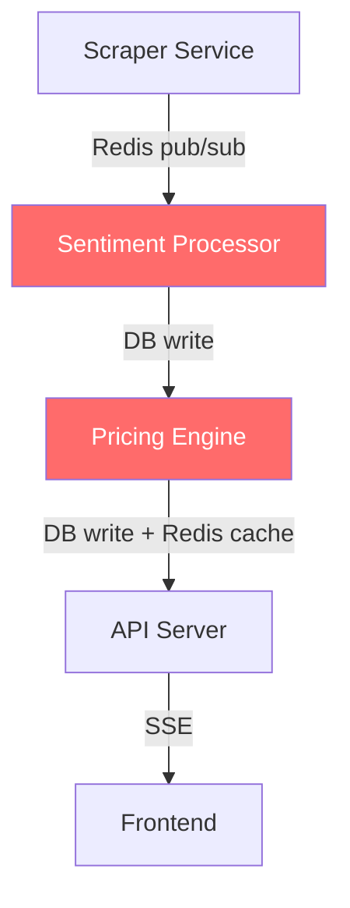

# SSE Spec v4 → Plans: Critical Gap Analysis & Suggested Fixes

> Multi-perspective review of the 5 implementation plans against the spec v4.
> This document is **read-only** — it does not modify any existing plan files.

---

## 1. Spec Coverage Gaps

### 🔴 CRITICAL-1: Pricing Engine Is Not a Separate Service

**Finding:** Spec §9 lists Scraper, Sentiment Processor, Pricing Engine, and API Server as four distinct services. `03_backend_api.md` embeds the Pricing Engine *inside* the FastAPI backend (TASK-BE19 through BE21).

**Risk:** A pricing bug or CPU spike takes down the API. No independent restart or resource isolation.

**Suggested Fix:** Create a new plan `02c_pricing_engine_service.md` extracting TASK-BE19/20/21 into a standalone Python service with:
- Its own scheduler (run after sentiment completes)
- Redis pub/sub subscriber for `sse:sentiment:run_complete`
- Health check endpoint
- Dedicated Dockerfile (already partially defined in OPS07)
- Writes results to `sentiment_prices` + Redis cache directly
- Publishes `sse:pricing:run_complete` to Redis for the API to pick up and SSE-broadcast

---

### 🔴 CRITICAL-2: Sentiment Processor Has No Runnable Service

**Finding:** `02_sentiment_analysis.md` defines the NLP pipeline logic but never wraps it in a service with a trigger, scheduler, or entry point. `run_sentiment_pipeline()` (TASK-NLP19) exists as a function but nothing invokes it.

**Risk:** The entire sentiment pipeline has no way to actually run in production.

**Suggested Fix:** Add a new plan `02b_sentiment_processor_service.md` with tasks for:
- **Service entry point** — `sentiment_service/main.py` running an event loop
- **Redis subscriber** — listens on `sse:scraper:run_complete` channel (published by TASK-S20)
- **Pipeline trigger** — on receiving scraper notification, queries new/updated `reddit_raw` rows, runs `run_sentiment_pipeline()`
- **Completion notification** — publishes to `sse:sentiment:run_complete` for the Pricing Engine
- **Scheduler fallback** — if Redis is down, poll DB for new data every N minutes
- **Health check** — `/health` endpoint reporting last run time, items processed
- **Dockerfile** — OPS06 already covers this, just needs to reference the service entry point

---

### 🔴 CRITICAL-3: No Event-Driven Pipeline Trigger Chain

**Finding:** The scraper publishes to `sse:scraper:run_complete` (TASK-S20), but no service subscribes. There is no defined trigger from sentiment completion to pricing engine.

**Risk:** Data flows into the DB but never gets processed without manual intervention.

**Suggested Fix:** Define a three-stage event chain:
```
Scraper completes
  → publishes sse:scraper:run_complete (already in TASK-S20)
  → Sentiment Processor subscribes, runs pipeline
    → publishes sse:sentiment:run_complete (NEW)
    → Pricing Engine subscribes, computes prices
      → publishes sse:pricing:run_complete (NEW)
      → API Server subscribes, broadcasts SSE to frontend (modify TASK-BE27)
```
Each stage should also support a poll-based fallback (check DB timestamps) for when Redis is unavailable.

---

### 🔴 CRITICAL-4: `ticker_mentioned` Schema Mismatch

**Finding:** Spec §5.5 defines `ticker_mentioned` as a singular `string`. TASK-S04 defines it as `List[str]`. DB schema (TASK-S02) has a single `ticker_mentioned` column. These are contradictory.

**Risk:** Breaks joins between raw data and sentiment tables. Multi-ticker posts either lose data or produce schema violations.

**Suggested Fix — Option A (Recommended): Normalize to one row per ticker.**
- A post mentioning TSLA and NVDA produces 2 rows sharing the same `reddit_id` but different `ticker_mentioned` values
- Change the UNIQUE constraint from `reddit_id` to `(reddit_id, ticker_mentioned)`
- `RawRedditItem.ticker_mentioned` stays `str` (singular), pipeline emits multiple items per post
- Simplifies all downstream queries (no array unpacking needed)

**Suggested Fix — Option B: Use array column.**
- Keep one row per post, change `ticker_mentioned` to `TEXT[]` in PostgreSQL
- Update all queries to use `ANY()` or `unnest()` for joins
- More storage-efficient but more complex queries

---

### 🟡 MODERATE-5: No Initial Sentiment Price Seeding

**Finding:** On first boot, there's no historical sentiment data. `compute_sentiment_price_delta()` handles `previous=None` but the initial price value is undefined.

**Suggested Fix:** Add a bootstrap task: when `previous=None`, set initial sentiment price equal to the current real market price. This makes the divergence start at zero, which is intuitive.

---

### 🟡 MODERATE-6: No Market Price Fetching Scheduler

**Finding:** TASK-BE16/17 implement yfinance and Finnhub providers, but nothing periodically calls them to fetch and store real prices.

**Suggested Fix:** Add a task for a `RealPriceFetcher` service/background job that:
- Runs every 5 minutes during US market hours (9:30 AM – 4:00 PM ET, Mon–Fri)
- Calls `get_batch_prices()` for all active tickers
- Writes to `real_prices` hypertable
- Updates Redis cache `sse:prices:current`
- Skips outside market hours (uses last close price)
- Can live inside the Pricing Engine service or as a separate scheduled task

---

### 🟡 MODERATE-7: SSE Endpoint Path Inconsistency

**Finding:** TASK-BE26 defines `GET /api/v1/tickers/{ticker}/stream` (per-ticker). TASK-FE15 hook `useSSEPrices` connects to `/api/v1/tickers/stream` (global). These are different endpoints.

**Suggested Fix:** Implement both:
- `/api/v1/tickers/stream` — global stream sending updates for all tickers (used by homepage)
- `/api/v1/tickers/{ticker}/stream` — per-ticker stream (used by detail page)
- Update both BE and FE plans to reference both endpoints explicitly

---

### 🟡 MODERATE-8: No Duplicate Content Detection

**Finding:** Spec §5.4 calls for filtering "copy-paste pump scheme content." Plans only address regex-based spam patterns, not near-duplicate text detection.

**Suggested Fix:** Add a similarity filter in TASK-S17: hash the first 200 chars of `source_text` (or use MinHash/SimHash). If a near-duplicate was seen within the last N hours from a different subreddit/post, flag or drop it. This catches cross-posted pump messages.

---

### 🟡 MODERATE-9: No Auth-Readiness Hooks

**Finding:** Spec §4.7 defers accounts but says architecture should consider them. No plan prepares for this.

**Suggested Fix:** Add optional auth middleware stub in the API:
- `get_current_user(request) -> Optional[User]` dependency that returns `None` for V1
- Reserve DB table name `users` by documenting it (don't create schema yet)
- Add `user_id` parameter stubs (nullable) to API schemas where relevant

---

## 2. Architectural Concerns

### 🔴 ARCH-1: Service Boundary Violations

**Finding:** Spec defines 4 services; plans create 2 running processes.

**Suggested Fix:** See CRITICAL-1 and CRITICAL-2 above. Create separate service plans for Sentiment Processor and Pricing Engine. The final Docker Compose should have:
```yaml
services:
  scraper:      ...   # Plan 01
  processor:    ...   # New plan 02b
  pricing:      ...   # New plan 02c (extracted from 03)
  api:          ...   # Plan 03 (slimmed down)
  frontend:     ...   # Plan 04
  postgres:     ...   # Plan 05
  redis:        ...   # Plan 05
  certbot:      ...   # Plan 05
  uptime-kuma:  ...   # Plan 05
```

---

### 🟡 ARCH-2: Dual Schema Definitions

**Finding:** TASK-S02 defines `reddit_raw` and TASK-BE04 defines `reddit_raw_data` — same table, different names and types.

**Suggested Fix:** Single source of truth: all schema migrations live in one place (e.g., `backend/migrations/`). The scraper service reads from this schema but does not own it. Remove TASK-S02's migration and make it reference the backend's migration output. Alternatively, create a shared `database/` package.

---

### 🟡 ARCH-3: Async vs Sync DB Drivers

**Finding:** Scraper uses `psycopg2` (sync), backend uses `asyncpg` (async). Both are fine but should be documented.

**Suggested Fix:** Add a note in each plan acknowledging this is intentional. Ensure no ORM model is shared between services — each service has its own DB interface.

---

## 3. Missing Optimizations

### PERF-1: Batch Sentiment Analysis

**Finding:** TASK-NLP19 processes comments one at a time. FinBERT is 10-20x faster with batch inference.

**Suggested Fix:** Extend the `SentimentAnalyzer` interface with `analyze_batch(texts: list[str]) -> list[float]`. Default implementation calls `analyze()` in a loop. FinBERT backend overrides with true batched inference (batch size 32-64). This is backward-compatible.

---

### PERF-2: Batch DB Upserts

**Finding:** TASK-S18 calls `upsert_raw_item()` per item — N roundtrips per scrape run.

**Suggested Fix:** Add `upsert_raw_items_batch(items: list[RawRedditItem])` to the repository. Use `psycopg2.extras.execute_values()` with the `ON CONFLICT` clause to batch all upserts into a single query. Expect 10-50x speedup for typical scrape batches of 100-500 items.

---

### PERF-3: Redis Connection Pooling

**Finding:** TASK-BE11 doesn't mention connection pooling.

**Suggested Fix:** Use `redis.asyncio.ConnectionPool(max_connections=50)` and pass it to the Redis client. Document the pool size in `.env.example`.

---

### PERF-4: TimescaleDB Continuous Aggregates

**Finding:** TASK-BE24 uses `time_bucket()` at query time for 1W/1M timeframes, rescanning raw data on every request.

**Suggested Fix:** Create TimescaleDB continuous aggregates:
```sql
CREATE MATERIALIZED VIEW sentiment_prices_1h
WITH (timescaledb.continuous) AS
SELECT time_bucket('1 hour', time) AS bucket,
       ticker,
       last(sentiment_price, time) AS sentiment_price,
       last(real_price_at_calc, time) AS real_price
FROM sentiment_prices
GROUP BY bucket, ticker;

SELECT add_continuous_aggregate_policy('sentiment_prices_1h',
  start_offset => INTERVAL '3 days',
  end_offset   => INTERVAL '1 hour',
  schedule_interval => INTERVAL '1 hour');
```
This pre-computes aggregates automatically. Query the continuous aggregate instead of raw table for 1W/1M views.

---

### PERF-5: Sentiment Result Caching

**Finding:** No caching prevents recomputing sentiment on unchanged text.

**Suggested Fix:** Before analyzing, check if `comment_sentiment` already has a row for this `reddit_comment_id` + `backend`. If yes and the text hasn't changed, skip analysis. Only re-analyze if score changed and `sentiment.recompute_on_score_change` config is true.

---

### PERF-6: React Query for Frontend

**Finding:** Manual fetch + state management in FE tasks.

**Suggested Fix:** Add TanStack Query (React Query) to TASK-FE01 dependencies. Use `useQuery` for all API calls — gives you automatic caching, deduplication, background refetching, and stale-while-revalidate. The SSE hook can use `queryClient.setQueryData()` to push real-time updates into the query cache, unifying REST and SSE data flows.

---

### SCRAPE-7: CAPTCHA Handling Strategy

**Finding:** Playwright doesn't solve CAPTCHAs.

**Suggested Fix:** Add a decision tree to TASK-S10:
1. If CAPTCHA detected, log WARNING and skip to next fallback (RSS/Pushshift)
2. Document that CAPTCHA-solving services (2Captcha, Anti-Captcha) can be integrated later
3. Add a config flag `SCRAPER_CAPTCHA_SERVICE_URL` (empty by default = skip on CAPTCHA)
4. Never block the pipeline waiting for CAPTCHA solution

---

### SCRAPE-8: Concurrent Subreddit Scraping

**Finding:** TASK-S13 scrapes subreddits sequentially.

**Suggested Fix:** Use `asyncio.gather()` or `concurrent.futures.ThreadPoolExecutor` to scrape all 4 subreddits concurrently. Each gets its own proxy from the rotation pool. Add a `MAX_CONCURRENT_SUBREDDITS` config (default: 4). This cuts total scrape time by ~75%.

---

### SCRAPE-9: Adaptive Scrape Interval

**Finding:** Interval is randomized but not adaptive to Reddit's response.

**Suggested Fix:** Track a `health_score` (0.0 to 1.0) based on recent scrape success rate. When health drops below 0.5, multiply the scrape interval by a configurable backoff factor (e.g., 2x). When health recovers above 0.8, return to normal interval. Log interval changes at INFO.

---

## 4. Risk Areas & Red Flags

### 🔴 RISK-1: Pushshift Is Dead

**Finding:** Pushshift API has been largely inaccessible since mid-2023.

**Suggested Fix:**
- Mark TASK-S12 as "CONDITIONAL — investigate availability before implementing"
- Add a research spike task: test Pushshift, Pullpush, and Arctic Shift APIs for actual availability
- If all are dead, replace with: Reddit's official API (free tier: 100 requests/minute for OAuth apps, sufficient for 4 subreddits)
- Alternative fallback: Google cache of Reddit pages, or Wayback Machine API

---

### 🔴 RISK-2: `old.reddit.com` May Be Deprecated

**Finding:** Primary scraping targets `old.reddit.com` HTML.

**Suggested Fix:**
- Add structural assertions in ListingScraper: verify expected CSS classes/IDs exist before parsing. If structure doesn't match, raise `StructureChangedError` (distinct from network errors)
- Add `new.reddit.com` parser as a parallel implementation (not just a fallback)
- Consider adding `sh.reddit.com` (Reddit's new "share" subdomain with simpler HTML)
- Monitor [reddit.com/r/changelog](https://reddit.com/r/changelog) for deprecation announcements

---

### 🔴 RISK-3: FinBERT Won't Fit on 2GB Droplet

**Finding:** FinBERT needs ~1.5GB RAM. A 2GB droplet runs PostgreSQL, Redis, and 5+ services.

**Suggested Fix:**
- Bump `TASK-OPS01` minimum to **4GB RAM** (8GB recommended)
- Add a `SENTIMENT_BACKEND` env var guard: if set to `finbert`, check available memory at startup and abort with a clear error if < 3GB free
- Default to `vader` in production until the accuracy validation (TASK-NLP08/09) proves FinBERT is needed
- Consider: FinBERT could use ONNX Runtime for ~40% less memory and 2x faster inference

---

### 🔴 RISK-4: No CI/CD Pipeline

**Finding:** 133 tasks, zero CI/CD.

**Suggested Fix:** Add a `06_cicd.md` plan with:
- **GitHub Actions workflow** for every push: lint (ruff), type check (mypy), unit tests (pytest)
- **Integration test job** on merge to main: spin up Docker Compose, run integration tests
- **Deploy job** on tag/release: SSH to droplet, pull latest, docker compose up
- **Frontend CI**: lint, type check, build verification
- **Pre-commit hooks**: ruff, mypy, pytest (fast subset)

---

### 🟡 RISK-5: Rate Limiting Duplication

**Finding:** Both TASK-BE12 and TASK-OPS19 define API rate limiting.

**Suggested Fix:** Delete TASK-OPS19 from the infra plan. Rate limiting is an application concern (TASK-BE12). The infra plan should only reference it as "verify rate limiting is working" in TASK-OPS30 (security checklist).

---

### 🟡 RISK-6: No Schema Evolution Strategy

**Finding:** Alembic mentioned once. No plan for managing schema changes over time.

**Suggested Fix:** Add a task in the backend plan:
- All services use a shared migration folder (`database/migrations/`)
- Alembic configured with `--autogenerate` support
- Migration MUST be backward-compatible (add columns nullable, never rename in place)
- Document rollback procedure for each migration

---

### 🟡 RISK-7: Logging Defined Three Times

**Finding:** TASK-S25, TASK-OPS18, TASK-OPS27 all define structured logging independently.

**Suggested Fix:** Create a shared `sse-common` Python package with:
- `logging_config.py` — shared structured logging setup
- `constants.py` — shared Redis channel names, log format strings
- All services depend on `sse-common`
- Remove duplicate logging tasks; keep one in a shared/common plan

---

### 🟡 RISK-8: No Load Testing

**Finding:** No performance validation before go-live.

**Suggested Fix:** Add a load testing task to the infra plan:
- Use `locust` or `wrk` to simulate 50 concurrent users hitting `/api/v1/tickers` and 20 SSE connections
- Run against the Docker Compose stack on the target droplet
- Document baseline: p50, p95, p99 latencies; max concurrent SSE connections before degradation
- Define acceptable thresholds (e.g., p95 < 500ms for REST, SSE reconnect < 5s)

---

## 5. Spec Ambiguities to Resolve

### AMBIG-1: Sentiment Price Base Value

**Spec says:** "Sentiment-derived price" — never defines the mathematical relationship to real price.

**Suggested Resolution:** Define `sentiment_price = real_price + sentiment_delta`. The delta is the output of the pricing formula. This anchors sentiment price to reality and makes divergence = delta, which is clean and intuitive. The alternative (computing an independent index) is harder to explain to users.

---

### AMBIG-2: Multi-Ticker Post Handling

**Spec says:** `ticker_mentioned: string` (singular).

**Suggested Resolution:** See CRITICAL-4 above. Normalize to one row per ticker. Split multi-ticker posts in the pipeline before DB insertion.

---

### AMBIG-3: Score Update → Sentiment Recomputation

**Spec says:** Scores update on re-scrape. Sentiment was computed on old score.

**Suggested Resolution:** Re-scraping updates `score` via upsert (TASK-S03). Sentiment should NOT be recomputed on every score change (too expensive). Instead:
- `weighted_sentiment` is recomputed during the next sentiment pipeline run using the latest `score` values from the DB
- This is a natural window-based recomputation, not event-driven
- Add a note in TASK-NLP14: "always query latest score from DB, not from cached pipeline state"

---

### AMBIG-4: Maximum Stale Data Age

**Spec says:** Hold last price, show staleness indicator.

**Suggested Resolution:** Define thresholds:
- < 30 min: green (fresh)
- 30–60 min: yellow (stale warning)
- 60 min – 4 hours: red (stale, show prominent warning)
- > 4 hours: hide sentiment price, show "Data unavailable" instead
- These thresholds should be configurable via `STALENESS_WARNING_SECONDS`, `STALENESS_CRITICAL_SECONDS`, `STALENESS_HIDE_SECONDS`

---

## 6. Cross-Plan Integration Gaps



> 🔴 **Red nodes** have no standalone service plan, scheduler, or entry point defined.

| # | Integration Point | Status | Suggested Fix |
|---|---|---|---|
| 1 | Scraper → Sentiment Processor | Publisher defined (TASK-S20), **subscriber missing** | Add subscriber in new Sentiment Processor service plan |
| 2 | Sentiment → Pricing Engine | **Not defined** | Add `sse:sentiment:run_complete` pub/sub event |
| 3 | Pricing → SSE broadcast | Works only if pricing is in-process with API | Pricing Engine publishes to Redis; API subscribes and broadcasts |
| 4 | Frontend SSE endpoint | Path inconsistency (global vs per-ticker) | Implement both endpoints, update FE plan |
| 5 | DB schema ownership | Scraper and Backend both define raw data table | Single migration owner (backend or shared package) |
| 6 | Shared constants | Redis channel names defined independently | Create shared `sse-common` package |

---

## 7. Summary — Priority Matrix

| Priority | Finding | Section |
|---|---|---|
| 🔴 P0 | Create Sentiment Processor service plan | CRITICAL-2 |
| 🔴 P0 | Create Pricing Engine service plan | CRITICAL-1 |
| 🔴 P0 | Define event-driven trigger chain | CRITICAL-3 |
| 🔴 P0 | Reconcile `ticker_mentioned` schema | CRITICAL-4 |
| 🔴 P0 | Add CI/CD pipeline plan | RISK-4 |
| 🔴 P1 | Validate Pushshift availability | RISK-1 |
| 🔴 P1 | Bump droplet to 4GB+ RAM | RISK-3 |
| 🟡 P2 | Add market price fetching scheduler | MODERATE-6 |
| 🟡 P2 | Add batch processing (FinBERT + DB) | PERF-1, PERF-2 |
| 🟡 P2 | Add TimescaleDB continuous aggregates | PERF-4 |
| 🟡 P2 | Fix SSE endpoint inconsistency | MODERATE-7 |
| 🟡 P2 | Consolidate duplicated concerns | RISK-5/6/7 |
| 🟡 P3 | Add load testing | RISK-8 |
| 🟡 P3 | Add seed price bootstrapping | MODERATE-5 |
| 🟡 P3 | Resolve spec ambiguities | AMBIG-1–4 |
| 🟡 P3 | Add auth-readiness hooks | MODERATE-9 |
